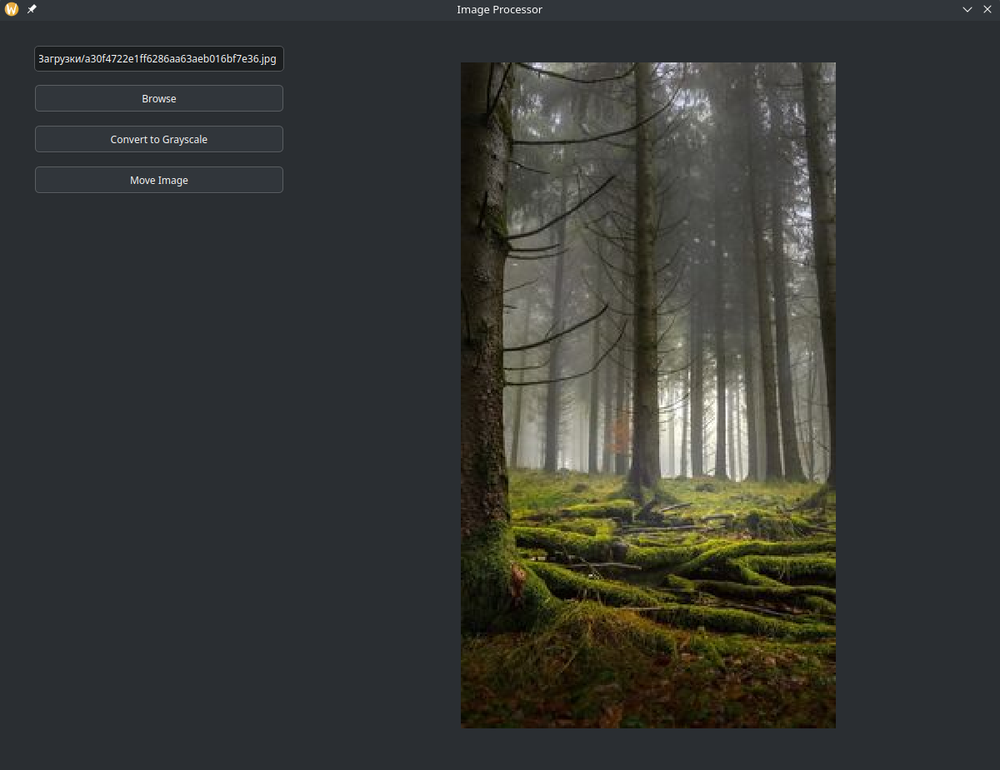

# Module for processing and working with images

A PyQt5-based application for image processing that allows users to convert images to grayscale and move them to different folders. This GUI tool is user-friendly and provides a fixed-size window layout for easy image management.

## Screenshot


## Installation

1. Clone this repository:
   ```bash
   git clone https://github.com/artemventvent/production_practice_Mallenom
   cd production_practice_Mallenom
2. Install required packages:
   pip install -r requirements.txt
3. Run the application:
   python main.py

## Usage
1. Browse for an Image: Click the "Browse" button to select an image file.
2. Convert to Grayscale: Click the "Convert to Grayscale" button to process the image.
3. Move Image: Click the "Move Image" button to select a folder where the image will be moved.
4. The converted grayscale image will be saved in the same directory as the original image.

## SOLID Principles
- Single Responsibility: Each class has a single purpose, e.g., GrayscaleImageProcessor handles image processing.
- Open/Closed: Classes can be extended without modifying their code.
- Liskov Substitution: All processor classes can be substituted without changing functionality.
- Interface Segregation: Interfaces for processing and moving files are separated.
- Dependency Inversion: High-level classes depend on abstractions (IImageProcessor), not on concrete implementations.
## Requirements
- Python 3.7+
- PyQt5
- Pillow (PIL)
